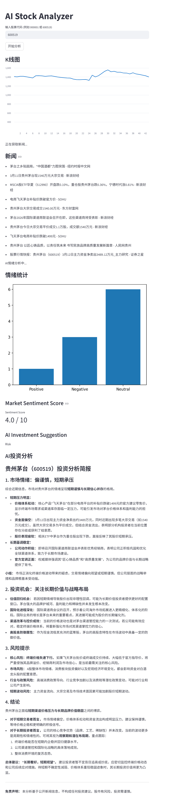

# AI Stock Analyzer

AI Stock Analyzer is a Python-based web application that combines stock market data, financial news aggregation, and large language models to generate sentiment analysis and investment insights.

The project demonstrates how AI can be integrated with financial data to build an intelligent analysis tool.

---

## Features

Stock Price Tracking
Retrieve current stock price and basic market information.

K-Line Visualization
Display recent price trends using simple charts.

News Aggregation
Collect recent financial news related to a selected stock.

AI Sentiment Analysis
Classify financial news into positive, negative, or neutral sentiment using a large language model.

AI Investment Insights
Generate a summarized report describing market sentiment, potential opportunities, and possible risks.

---

## Technology Stack

Python
Streamlit
Matplotlib
RSS News Sources
DeepSeek API

---

## Project Structure

```
ai-stock-analyzer
│
├── app.py
├── analyzer.py
├── requirements.txt
└── README.md
```

app.py
Streamlit web interface.

analyzer.py
Handles data collection and AI-based analysis.

requirements.txt
Lists project dependencies.

---

## Installation

Clone the repository:

```
git clone https://github.com/YOUR_USERNAME/ai-stock-analyzer.git
```

Enter the project directory:

```
cd ai-stock-analyzer
```

Install dependencies:

```
pip install -r requirements.txt
```

---

## API Configuration

Set the DeepSeek API key as an environment variable.

Linux / macOS:

```
export DEEPSEEK_API_KEY="your_api_key"
```

Windows PowerShell:

```
setx DEEPSEEK_API_KEY "your_api_key"
```

---

## Running the Application

Start the Streamlit server:

```
streamlit run app.py
```

Then open the browser and visit:

```
http://localhost:8501
```

---

## Example Workflow

1. Enter a stock code such as `000001` or `600519`.
2. The application retrieves market price data.
3. Related financial news is collected.
4. AI analyzes the sentiment of the news.
5. A summarized investment report is generated.

---

## Future Improvements

Multi-source financial news aggregation
AI-based short-term trend prediction
Portfolio analysis tools
Deployment as an online web application

---

## License

MIT License

## Demo

